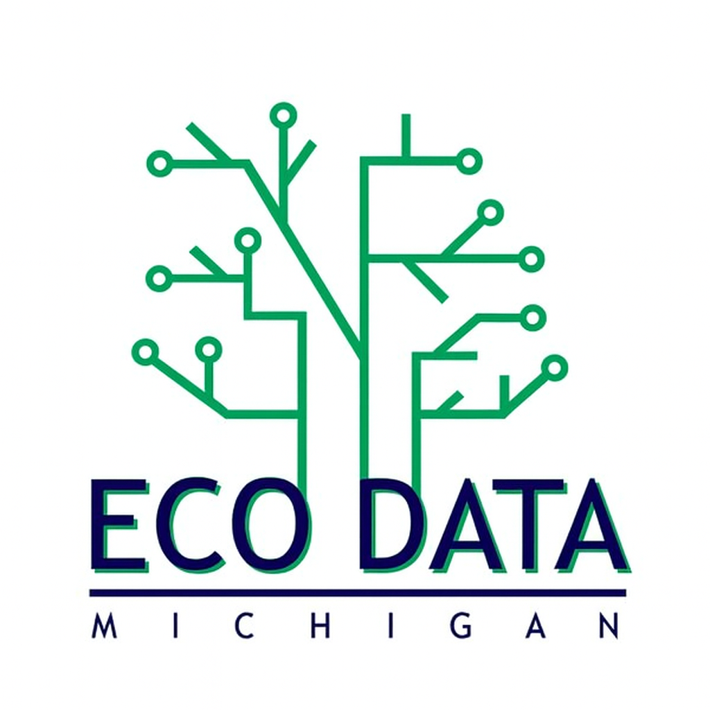
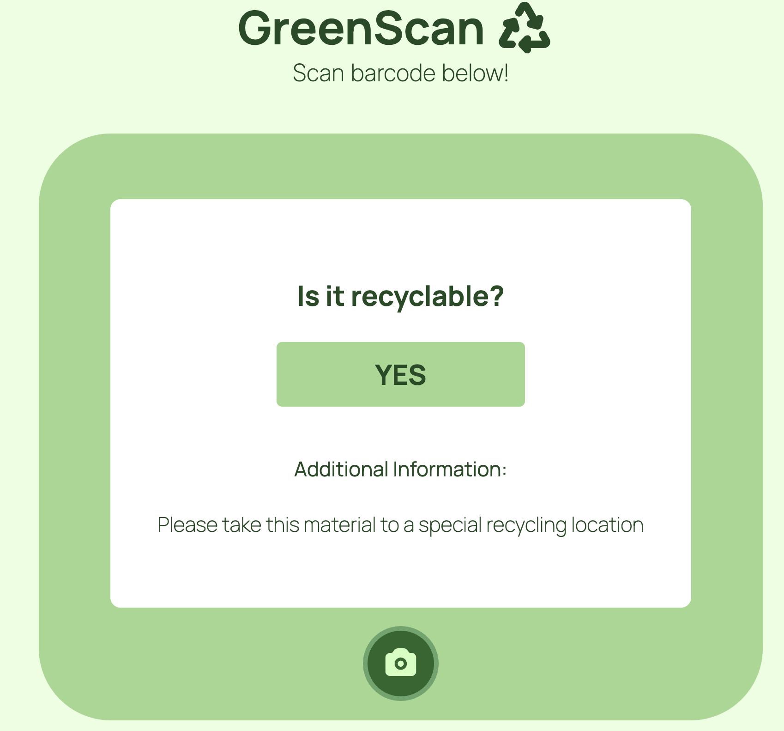

# Ecodata RecycleRight

<div align="center">
  
</div>

---

## Project Description

Our waste tracker website provides an easy way to track waste usage, as well as learn more about recycling guidelines. Designed for anyone wanting to be more conscious of their carbon footprint, it solves all the unknowns and struggles with proper waste disposal by providing by providing a one-stop shop for all your recycling and trash guideline needs.

---

## Table of Contents

- [Quick Start](#-quick-start)
- [Installation](#-installation)
- [Features](#-features)
- [Usage Examples](#-usage-examples)
- [FAQ](#-frequently-asked-questions)
- [License](#-license)
- [Support](#-support)

---

## Quick Start

Get up and running in less than 5 minutes:

### Prerequisites

- [Node.js] (latest version)


### Installation

#### Clone from Source
```bash
git clone https://github.com/admwoo/waste-tracker-f24.git
cd project-name
```
#### npm installs
```bash
npm install
npm install express
npm install body-parser
npm install express-session
npm install express-flash
npm install sqlite3
npm install ejs

```


### Basic Setup

1. **Start the development server**
   ```bash
   node server.js
   ```

2. **Open your browser** to `http://localhost:3002`

**That's it! Your project is now running.**

<div align="center">
  
</div>

---

## Features

### Core Features

#### Feature 1: GreenScan Item Scanner

Have an item to dispose but don't know what to do with it? Scan your item, and we'll provide guidelines on how to dispose of it, and log it into your waste tracker. 

<div align="center">
  
</div>


#### Additional Features
- General Recycling guidelines
- Login and Signup
- Progress tracker
---

## 💡 Usage Examples

### Basic Usage

To access basic features such as the waste or progress tracker, you must login with an account. If you don't have an account, you can register one on the signup page.

<div align="center">
  
</div>


## Frequently Asked Questions

### General Questions

**Q: What makes RecycleRight different from alternatives?**
A: Not only does RecycleRight provide a user friendly site to track you carbon footprint by waste disposal, but it also has object detection and classification abilities to seamlessly and quickly provide guidelines for an item and store it in the waste tracker.

**Q: Is RecycleRight suitable for production use?**
A: Unfortunately not currently. While you can access the website locally, there are still some features and aspects that are still in progress of developing. Feel free to still visit the website to use its current functionality, and we welcome any feedback you may have.


## License

This project is licensed under the MIT License.


## Acknowledgments

Special thanks to all our contributors who make this project possible.

---
